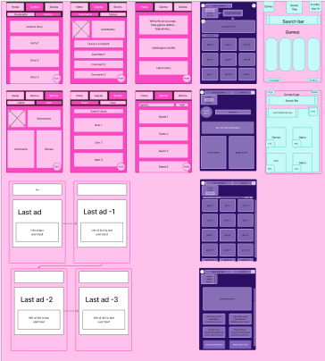

Project name: CritPixel
Vercel link: https://final-project-week12.vercel.app
Repo link: https://github.com/ScatterCookie/final-project-week12

If you wish to clone this yourself and have a play around or maybe improve on somethings, here's how:

Make a directory in your Ubuntu terminal where you would like this to be stored and input this as follows: 

git init
git clone git@github.com:ScatterCookie/final-project-week12.git
npm i
npm run dev

Team members: Angus, Eddy, Liam and Hassan

Project description:
A site which allows you to follow your latest games as well as being able to comment on those games, write stories and experiences about those games that are personal to you. If you find we don't have the game you're looking for, don't sweat, you can also add games to make it fit your style.

Problem domain: 
CritPixel aims to provide a platform to share your stories through games and be able to share with others.

USER STORIES
As a user I want to be able to login and be remembered.
As a user I want to to add, edit and delete games.
As a user I want to to comment on the games.
As a user I want to have a dedicated profile page.
As a user I want to  view all games when clicked, shows associated reviews and stories.
As a user I want to be able to edit my own posts.
As a user I want it to be visually appealing and intuitive
As a user I want to be able to have my gamer tag as a user.

We used PG as a main package, we also tried to install numerous font styles but Vercel didn't like rendering those, so we removed them.

HOW TO RUN THE APP:
 After cloning the repo, if you wish to run this, use npm run dev in your coding platform terminal and this will open http://localhost:3000. You will have to create your own .env file and SQL database to be able to interact with the code

Reflections:
 We Ran into very few roadblock when completing the functionality of the website. There was only one major roadblock and this was on the stretch goal we had set ourselves being the search bar function for games on the games page.
 We ran into more roadblocks on the Styling side with creating the animations and running low on time as such we focused on the desktop view of the site as we thought most of the future trafic would be from desktop and not the modile view.
 We had no issues with planning and deciding a project as we all came together and built something we were all interested in.
 
What went really well and what could have gone better?
The creation of the MVP without styling was smooth and ran into little errors along the way that wern't able to be solved with some colaborative coding.

References:
We used the Youtube API and a couple youtube videos for one of the stretch goals being the search bar which was not implemented in time for the final submition.
